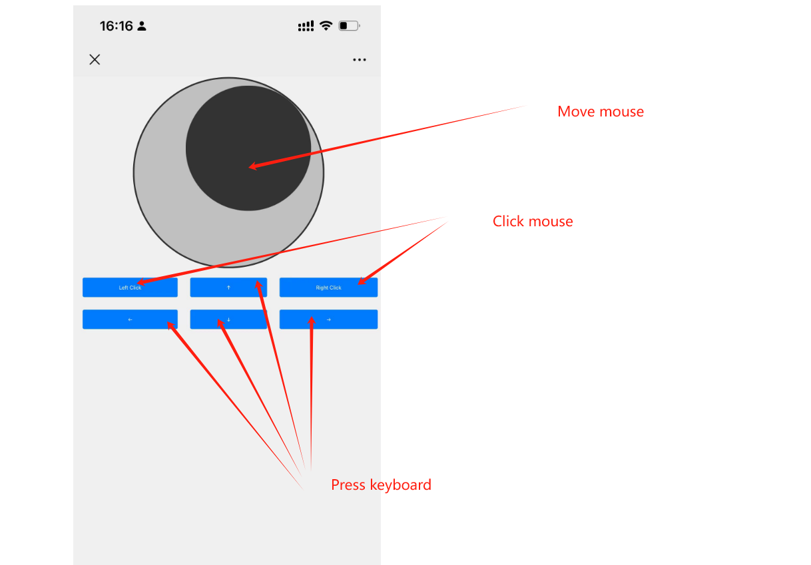

# Mouse and Keyboard Controller via Web Interface

This Go application creates a simple web interface to control the mouse and keyboard on a local machine. It uses the [Robotgo](https://github.com/go-vgo/robotgo) library to send mouse and keyboard events to the operating system. The web interface is served over HTTP and allows basic interactions like clicking the mouse, moving the cursor, and pressing arrow keys.

## Features

- Mouse clicking (left and right)
- Arrow key pressing (up, down, left, right)
- Cursor movement within the screen boundaries
- Static file serving for the frontend (HTML, CSS, JavaScript)

## Requirements

- Go 1.16+ (for `embed` functionality)
- Robotgo library (install via `go get github.com/go-vgo/robotgo`)

## How to Use

1.Download the [Application](https://github.com/weiwentao996/pc-web-control/releases/download/release-v1.0.0/pc-web-control-win.zip)

Get the PC Web Control zip package.

2.Unzip and Run

Extract the downloaded package and run the executable program included.

3.Access the Web Interface

Find your computer's local IP address, then, using your mobile phone (which must be on the same network as your computer), visit http://yourIP:8080 in a browser. You’ll be able to interact with the control interface.

